# Indian General Election 2024 SQL Project

## Introduction
SQL (Structured Query Language) has been a cornerstone for managing and querying relational databases, especially when dealing with large datasets. In this project, SQL is used to explore insights from the Indian General Election 2024. The project highlights how SQL can effectively solve various business problems by querying election results using simple yet powerful functions.

## Table of Contents
1. [Overview](#1-overview)
2. [Business Problems Solved](#2-business-problems-solved)
3. [Project Structure](#3-project-structure)
4. [Key SQL Queries](#4-key-sql-queries)
5. [Appendix](#5-appendix-sql-table-structure)
6. [Conclusion](#6-conclusion)

---

## 1. Overview
This project aims to showcase the power of SQL by solving real-world business problems using the results of the Indian General Election 2024 dataset. The insights are derived from the election data, showing seat distribution across states, party alliances, and the results of various parties.

The data is stored in multiple tables, and the solution uses SQL queries to perform operations like aggregations, joins, and case-based updates to explore the election results.

---

## 2. Business Problems Solved
Here are the key business problems addressed in this project:

1. **Total Number of Parliament Constituency Seats**
   - How many parliamentary constituency seats were contested in the 2024 General Election?

2. **Total Number of Seats per State**
   - What is the total number of seats available for each state in the General Election?

3. **Assigning Party Alliances**
   - How can we categorize political parties into alliances like NDA, INDIA, and OTHER using SQL queries?

4. **Total Seats Won by NDA**
   - How many seats were won by the NDA alliance?

---

## 3. Project Structure

The project consists of the following key components:

### Database Creation
SQL Commands used to create the database and import the required datasets:

```sql
CREATE DATABASE [2024 India General Election];
```
Data Inspection

SQL commands to explore the structure of the tables:

```sql
SELECT COLUMN_NAME, DATA_TYPE, ORDINAL_POSITION
FROM INFORMATION_SCHEMA.COLUMNS
WHERE TABLE_NAME = 'constituencywise_details';
```

Descriptive Table Overview

The project uses the following 5 tables:

1. constituencywise_details: Contains details about each parliamentary constituency.

    Key Columns: Constituency_ID, Candidate, Party, EVM_Votes, etc.

2. constituencywise_results: Stores election results for each parliamentary constituency.

    Key Columns: Constituency_ID, Party_ID, Parliament_Constituency, Winning_Candidate, etc.

3. statewise_results: Includes aggregated election results by state.

    Key Columns: State_ID, State, Leading_Candidate, Trailing_Candidate, Margin, etc.

4. partywise_results: Contains results for each party by parliamentary constituency.

    Key Columns: Party_ID, Party, Party_Alliance, etc.

5. states: Stores information about states, including state IDs and names.

    Key Columns: State_ID, State_Name.

---

## 4. Key SQL Queries

	- Total Seats in Indian Parliament
Query 1: Get the total number of seats in the Indian Parliament for 2024.
```sql
SELECT COUNT (DISTINCT Constituency_ID) AS 'India Parliament Constituency Seats'
	FROM constituencywise_results;
```
Data preview:

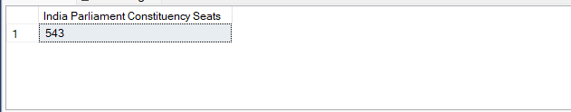

<sup/>[↑ Back to Top](#table-of-contents)

	- Total Seats by State
Query 2: Find the total number of seats available in each state for the 2024 elections.
```sql
SELECT State_Name, COUNT(DISTINCT Constituency_ID) AS 'Total Seats'
FROM constituencywise_results
GROUP BY State_Name;
```
Data preview:

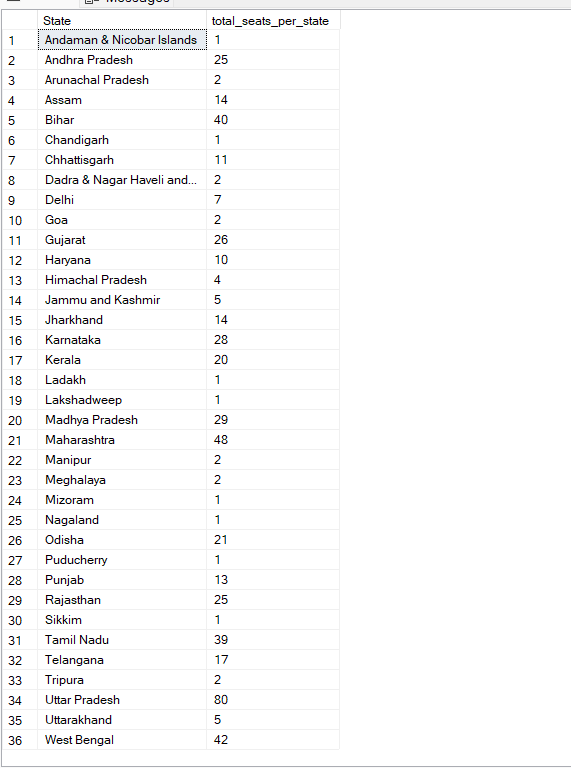

<sup/>[↑ Back to Top](#table-of-contents)

	- Total Seats Won by NDA
Query 3: Calculate the total seats won by the NDA alliance in the 2024 elections.
```sql
WITH NDA_parties AS (
    SELECT Party_ID, Won
	FROM partywise_results
    WHERE Party IN ('Bharatiya Janata Party - BJP'
		, 'Telugu Desam - TDP'
		, 'Janata Dal  (United) - JD(U)'
		, 'Shiv Sena - SHS'
		, 'AJSU Party - AJSUP'
		, 'Apna Dal (Soneylal) - ADAL'
		, 'Asom Gana Parishad - AGP'
		, 'Hindustani Awam Morcha (Secular) - HAMS'
		, 'Janasena Party - JnP'
		, 'Janata Dal  (Secular) - JD(S)'
		, 'Lok Janshakti Party(Ram Vilas) - LJPRV'
		, 'Nationalist Congress Party - NCP'
		, 'Rashtriya Lok Dal - RLD'
		, 'Sikkim Krantikari Morcha - SKM')
)
, Constituency_agg AS (
    SELECT Party_ID, COUNT(DISTINCT (Constituency_ID)) AS Total_Seats
    FROM constituencywise_results
    GROUP BY Party_ID)
SELECT
    COUNT(NP.Party_ID) AS NDA_Allianz_Total_Parties
    , SUM(NP.Won) AS NDA_Allianz_Total_Seats_Won
    , (SELECT COUNT(DISTINCT (Constituency_ID)) FROM constituencywise_results) AS Total_Seats
FROM NDA_parties NP
JOIN Constituency_agg CA ON NP.Party_ID = CA.Party_ID;
```
Data preview:

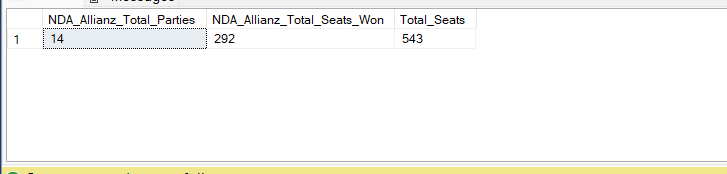

<sup/>[↑ Back to Top](#table-of-contents)

	- NDA Seats by Party
 Query 4: List the seats won by each party in the NDA alliance.
 ```sql
SELECT 
    party as NDA_Alliance_Party_Name,
    won as Seats_Won
FROM partywise_results
    WHERE Party IN ('Bharatiya Janata Party - BJP'
		, 'Telugu Desam - TDP'
		, 'Janata Dal  (United) - JD(U)'
		, 'Shiv Sena - SHS'
		, 'AJSU Party - AJSUP'
		, 'Apna Dal (Soneylal) - ADAL'
		, 'Asom Gana Parishad - AGP'
		, 'Hindustani Awam Morcha (Secular) - HAMS'
		, 'Janasena Party - JnP'
		, 'Janata Dal  (Secular) - JD(S)'
		, 'Lok Janshakti Party(Ram Vilas) - LJPRV'
		, 'Nationalist Congress Party - NCP'
		, 'Rashtriya Lok Dal - RLD'
		, 'Sikkim Krantikari Morcha - SKM')
ORDER BY 2 DESC;
```
Data preview:

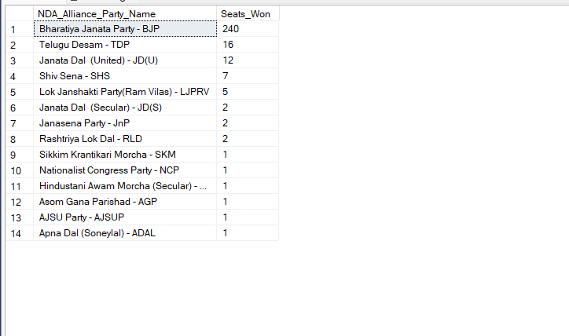

 <sup/>[↑ Back to Top](#table-of-contents)

	- Total Seats Won by INDIA Alliance
 Query 5: Calculate the total seats won by the INDIA alliance in the 2024 elections.
 ```sql
WITH INDIA_parties AS (
    SELECT Party_ID, Won
	FROM partywise_results
    WHERE Party IN ('Indian National Congress - INC'
		, 'Aam Aadmi Party - AAAP'
		, 'All India Trinamool Congress - AITC'
		, 'Bharat Adivasi Party - BHRTADVSIP'
		, 'Communist Party of India  (Marxist) - CPI(M)'
		, 'Communist Party of India  (Marxist-Leninist)  (Liberation) - CPI(ML)(L)'
		, 'Communist Party of India - CPI'
		, 'Dravida Munnetra Kazhagam - DMK'
		, 'Indian Union Muslim League - IUML'
		, 'Nat`Jammu & Kashmir National Conference - JKN'
		, 'Jharkhand Mukti Morcha - JMM'
		, 'Jammu & Kashmir National Conference - JKN'
		, 'Kerala Congress - KEC'
		, 'Marumalarchi Dravida Munnetra Kazhagam - MDMK'
		, 'Nationalist Congress Party Sharadchandra Pawar - NCPSP'
		, 'Rashtriya Janata Dal - RJD'
		, 'Rashtriya Loktantrik Party - RLTP'
		, 'Revolutionary Socialist Party - RSP'
		, 'Samajwadi Party - SP'
		, 'Shiv Sena (Uddhav Balasaheb Thackrey) - SHSUBT'
		, 'Viduthalai Chiruthaigal Katchi - VCK')
)
, Constituency_agg AS (
    SELECT Party_ID, COUNT(DISTINCT (Constituency_ID)) AS Total_Seats
    FROM constituencywise_results
    GROUP BY Party_ID)
SELECT
    COUNT(IP.Party_ID) AS INDIA_Allianz_Total_Parties
    , SUM(IP.Won) AS INDIA_Allianz_Total_Seats_Won
    , (SELECT COUNT(DISTINCT (Constituency_ID)) FROM constituencywise_results) AS Total_Seats
FROM INDIA_parties IP
JOIN Constituency_agg CA ON IP.Party_ID = CA.Party_ID;
```
Data preview:

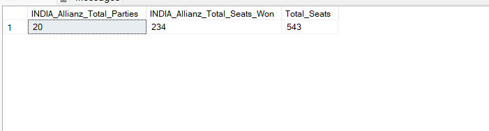

<sup/>[↑ Back to Top](#table-of-contents)

	- INDIA Seats by Party
 Query 6: List the seats won by each party in the INDIA alliance.
 ```sql
SELECT 
    party as INDIA_Alliance_Party_Name,
    won as Seats_Won
FROM 
    partywise_results
    WHERE Party IN ('Indian National Congress - INC'
		, 'Aam Aadmi Party - AAAP'
		, 'All India Trinamool Congress - AITC'
		, 'Bharat Adivasi Party - BHRTADVSIP'
		, 'Communist Party of India  (Marxist) - CPI(M)'
		, 'Communist Party of India  (Marxist-Leninist)  (Liberation) - CPI(ML)(L)'
		, 'Communist Party of India - CPI'
		, 'Dravida Munnetra Kazhagam - DMK'
		, 'Indian Union Muslim League - IUML'
		, 'Nat`Jammu & Kashmir National Conference - JKN'
		, 'Jharkhand Mukti Morcha - JMM'
		, 'Jammu & Kashmir National Conference - JKN'
		, 'Kerala Congress - KEC'
		, 'Marumalarchi Dravida Munnetra Kazhagam - MDMK'
		, 'Nationalist Congress Party Sharadchandra Pawar - NCPSP'
		, 'Rashtriya Janata Dal - RJD'
		, 'Rashtriya Loktantrik Party - RLTP'
		, 'Revolutionary Socialist Party - RSP'
		, 'Samajwadi Party - SP'
		, 'Shiv Sena (Uddhav Balasaheb Thackrey) - SHSUBT'
		, 'Viduthalai Chiruthaigal Katchi - VCK')
ORDER BY 2 DESC;
```
Data preview:

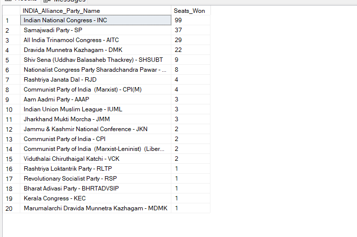

<sup/>[↑ Back to Top](#table-of-contents)

	- Add Party Alliance Column
 Query 7: Add a column to categorize parties into NDA, INDIA, or OTHER alliances.
 ```sql
ALTER TABLE partywise_results
ADD party_alliance VARCHAR(50);

UPDATE partywise_results
SET party_alliance = 
    CASE 
        WHEN party IN ('Bharatiya Janata Party - BJP'
            , 'Telugu Desam - TDP'
            , 'Janata Dal  (United) - JD(U)'
            , 'Shiv Sena - SHS'
            , 'AJSU Party - AJSUP'
            , 'Apna Dal (Soneylal) - ADAL'
            , 'Asom Gana Parishad - AGP'
            , 'Hindustani Awam Morcha (Secular) - HAMS'
            , 'Janasena Party - JnP'
            , 'Janata Dal  (Secular) - JD(S)'
            , 'Lok Janshakti Party(Ram Vilas) - LJPRV'
            , 'Nationalist Congress Party - NCP'
            , 'Rashtriya Lok Dal - RLD'
            , 'Sikkim Krantikari Morcha - SKM'
        ) THEN 'NDA'
        WHEN party IN ('Indian National Congress - INC'
            , 'Aam Aadmi Party - AAAP'
            , 'All India Trinamool Congress - AITC'
            , 'Bharat Adivasi Party - BHRTADVSIP'
            , 'Communist Party of India  (Marxist) - CPI(M)'
            , 'Communist Party of India  (Marxist-Leninist) (Liberation) - CPI(ML)(L)'
            , 'Communist Party of India - CPI'
            , 'Dravida Munnetra Kazhagam - DMK'
            , 'Indian Union Muslim League - IUML'
            , 'Jammu & Kashmir National Conference - JKN'
            , 'Jharkhand Mukti Morcha - JMM'
            , 'Kerala Congress - KEC'
            , 'Marumalarchi Dravida Munnetra Kazhagam - MDMK'
            , 'Nationalist Congress Party Sharadchandra Pawar - NCPSP'
            , 'Rashtriya Janata Dal - RJD'
            , 'Rashtriya Loktantrik Party - RLTP'
            , 'Revolutionary Socialist Party - RSP'
            , 'Samajwadi Party - SP'
            , 'Shiv Sena (Uddhav Balasaheb Thackrey) - SHSUBT'
            , 'Viduthalai Chiruthaigal Katchi - VCK'
        ) THEN 'INDIA'
        ELSE 'OTHER'
    END;
```
Data preview:

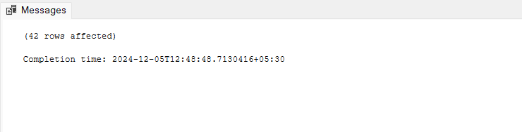

<sup/>[↑ Back to Top](#table-of-contents)

	- Alliance with Most Seats
 Query 8: Identify the party alliance that won the most seats nationwide.
 ```sql
SELECT 
	pr.party_alliance, COUNT(cr.Parliament_Constituency) Seats_Won
	FROM partywise_results pr
JOIN constituencywise_results cr ON pr.Party_ID = cr.Party_ID
where pr.party_alliance IN ('NDA', 'INDIA', 'OTHER')
GROUP BY pr.party_alliance
ORDER BY 2 DESC;
```
Data preview:

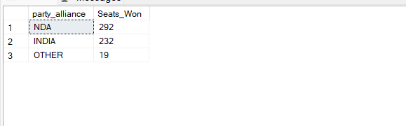

<sup/>[↑ Back to Top](#table-of-contents)

	- Winning Details for a Specific Constituency
 Query 9: Retrieve the winning candidate's name, party, alliance, total votes, and margin for a specific state and constituency.
 ```sql
SELECT
	s.State, cr.Constituency_Name
	FROM constituencywise_results cr
JOIN statewise_results sr ON cr.Parliament_Constituency = sr.Parliament_Constituency
JOIN states s ON sr.State_ID = s.State_ID
WHERE s.State = 'Uttar Pradesh';

SELECT
	cr.Winning_Candidate, pr.Party, pr.party_alliance
	, FORMAT(cr.Total_Votes, 'N0', 'en-IN') AS Total_Votes
	, FORMAT(cr.Margin, 'N0', 'en-IN') AS Margin
	, s.State, cr.Constituency_Name
	FROM partywise_results pr
JOIN constituencywise_results cr ON pr.Party_ID = cr.Party_ID
JOIN statewise_results sr ON cr.Parliament_Constituency = sr.Parliament_Constituency
JOIN states s ON sr.State_ID = s.State_ID
WHERE s.State = 'Uttar Pradesh' AND cr.Constituency_Name = 'ETAH';
```
Data preview:


<sup/>[↑ Back to Top](#table-of-contents)

	- EVM vs Postal Vote Distribution
 Query 10: Analyze the distribution of EVM votes versus postal votes in a specific constituency.
 ```sql
SELECT
	DISTINCT Constituency_Name
	FROM constituencywise_results
WHERE Constituency_Name LIKE 'D%';

SELECT
	cd.Candidate, cd.Party
	, FORMAT(cd.EVM_Votes, 'N0', 'en-IN') AS EVM_Votes
	, FORMAT(cd.Postal_Votes, 'N0', 'en-IN') AS Postal_Votes
	, FORMAT(cd.Total_Votes, 'N0', 'en-IN') AS Total_Votes
	, cr.Constituency_Name
	FROM constituencywise_details cd
JOIN constituencywise_results cr ON cd.Constituency_ID = cr.Constituency_ID
WHERE cr.Constituency_Name='DURG'
ORDER BY 5 DESC;
```
Data preview:

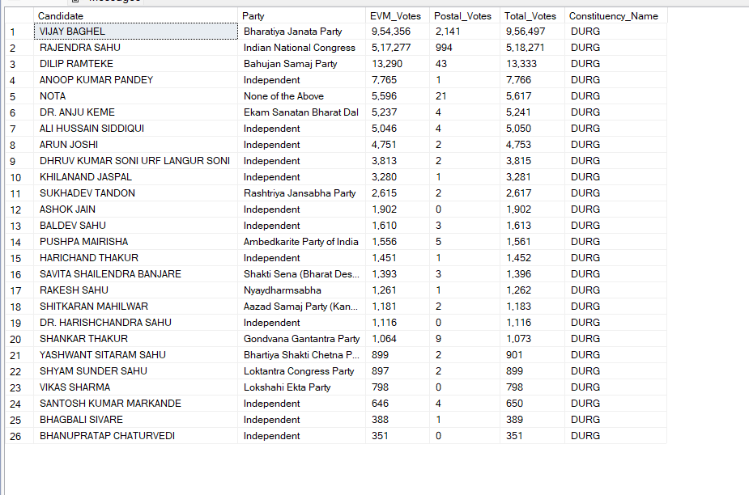

<sup/>[↑ Back to Top](#table-of-contents)

	- Most Seats Won in a State
 Query 11: Find the parties that won the most seats in a state, along with seat counts.
 ```sql
SELECT
	pr.Party, COUNT(cr.Constituency_ID) AS Seats_Won
	FROM partywise_results pr
JOIN constituencywise_results cr ON pr.Party_ID = cr.Party_ID
JOIN statewise_results sr ON cr.Parliament_Constituency = sr.Parliament_Constituency
JOIN states s ON sr.State_ID = s.State_ID
WHERE s.State = 'Andhra Pradesh'
GROUP BY pr.Party
ORDER BY 2 DESC;
```
Data preview:

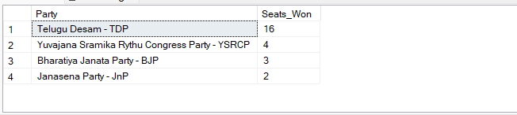

<sup/>[↑ Back to Top](#table-of-contents)

	- Alliance-wise Wins by State
 Query 12: Calculate the total seats won by each alliance in each state.
 ```sql
SELECT
	st.State
	, SUM(CASE WHEN pr.party_alliance='NDA' THEN 1 ELSE NULL END) AS NDA_Seats_Won
	, SUM(CASE WHEN pr.party_alliance='INDIA' THEN 1 ELSE NULL END) AS INDIA_Seats_Won
	, SUM(CASE WHEN pr.party_alliance='OTHER' THEN 1 ELSE NULL END) AS OTHER_Seats_Won
	FROM states st
JOIN statewise_results sr ON st.State_ID = sr.State_ID
JOIN constituencywise_results cr ON sr.Parliament_Constituency = cr.Parliament_Constituency
JOIN partywise_results pr ON cr.Party_ID = pr.Party_ID
-- WHERE pr.party_alliance IN ('NDA', 'INDIA', 'OTHER')
WHERE st.State IN ('Assam', 'Bihar')
GROUP BY st.State
ORDER BY st.State;

-- OR --

WITH Party_Alliance_Winnings AS (
    SELECT st.State
        , SUM(CASE WHEN pr.Party_Alliance = 'NDA' THEN 1 ELSE 0 END) AS NDA_Won_Seats
        , SUM(CASE WHEN pr.Party_Alliance = 'INDIA' THEN 1 ELSE 0 END) AS INDIA_Won_Seats
        , SUM(CASE WHEN pr.Party_Alliance = 'OTHER' THEN 1 ELSE 0 END) AS Other_Won_Seats
    FROM states st
    JOIN statewise_results sr ON st.State_ID = sr.State_ID
    JOIN constituencywise_results cr ON sr.Parliament_Constituency = cr.Parliament_Constituency
    JOIN partywise_results pr ON cr.Party_ID = pr.Party_ID
    WHERE st.State IN ('Assam', 'Bihar')
    GROUP BY st.State
)
SELECT PAW.*
    , (SELECT COUNT(DISTINCT sr.Parliament_Constituency)
       FROM statewise_results sr
       WHERE sr.State_ID = (
		SELECT st2.State_ID FROM states st2 WHERE st2.State = PAW.State)
      ) AS Total_Constituencies
FROM Party_Alliance_Winnings PAW;
```
Data preview:

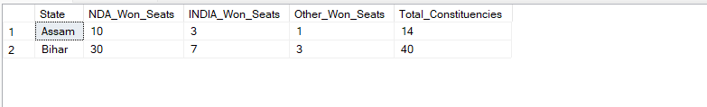

<sup/>[↑ Back to Top](#table-of-contents)

	- Top EVM Votes by Constituency
 Query 13: Identify the top candidates by EVM votes for each constituency.
 ```sql
SELECT TOP 10
	cd.Constituency_ID, cr.Constituency_Name, cd.Candidate
	, FORMAT(cd.EVM_Votes, 'N0', 'en-IN') AS EVM_Votes
	FROM constituencywise_details cd
JOIN constituencywise_results cr ON cd.Constituency_ID = cr.Constituency_ID
WHERE cd.EVM_Votes = (
	SELECT MAX(cd1.EVM_Votes)
	FROM constituencywise_details cd1
	WHERE cd1.Constituency_ID = cd.Constituency_ID)
ORDER BY 4 DESC;
```
Data preview:

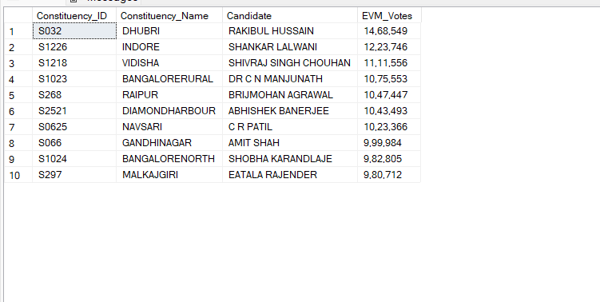

<sup/>[↑ Back to Top](#table-of-contents)

	- Winner and Runner-up by Constituency
 Query 14: Find the winner and runner-up for each constituency in a given state.
 ```sql
WITH RankedCandidates AS (
    SELECT 
        cd.Constituency_ID
        , cd.Candidate
		, ROW_NUMBER() OVER (PARTITION BY cd.Constituency_ID ORDER BY cd.Total_Votes DESC) AS VoteRank
    FROM constituencywise_details cd
    JOIN constituencywise_results cr ON cd.Constituency_ID = cr.Constituency_ID
    JOIN statewise_results sr ON cr.Parliament_Constituency = sr.Parliament_Constituency
    JOIN states st ON sr.State_ID = st.State_ID
    WHERE st.State = 'Gujarat'
)
SELECT 
    cr.Constituency_Name
    , MAX(CASE WHEN rc.VoteRank = 1 THEN rc.Candidate END) AS Winning_Candidate
    , MAX(CASE WHEN rc.VoteRank = 2 THEN rc.Candidate END) AS Runnerup_Candidate
FROM RankedCandidates rc
JOIN constituencywise_results cr ON rc.Constituency_ID = cr.Constituency_ID
GROUP BY cr.Constituency_Name
ORDER BY cr.Constituency_Name;

-- OR --

WITH ElectionResultsRank AS (
    SELECT
        st.State,
        cr.Constituency_Name,
        cd.Candidate,
        cd.Party,
        ROW_NUMBER() OVER (PARTITION BY cd.Constituency_ID ORDER BY cd.Total_Votes DESC) AS Rank_Position
    FROM states st
    JOIN statewise_results sr ON st.State_ID = sr.State_ID
    JOIN constituencywise_results cr ON sr.Parliament_Constituency = cr.Parliament_Constituency
    JOIN constituencywise_details cd ON cr.Constituency_ID = cd.Constituency_ID
)
SELECT
    ER.State,
    ER.Constituency_Name,
    MAX(CASE WHEN ER.Rank_Position = 1 THEN ER.Candidate END) AS Winner,
    MAX(CASE WHEN ER.Rank_Position = 1 THEN ER.Party END) AS Winner_Party,
    MAX(CASE WHEN ER.Rank_Position = 2 THEN ER.Candidate END) AS Runner_Up,
    MAX(CASE WHEN ER.Rank_Position = 2 THEN ER.Party END) AS Runner_Up_Party
FROM ElectionResultsRank ER
-- WHERE ER.State = 'Gujarat'
WHERE ER.State = 'Gujarat'  -- condition to filter by state if needed, so!!
GROUP BY ER.State, ER.Constituency_Name
ORDER BY 1, 2;
```
Data preview:

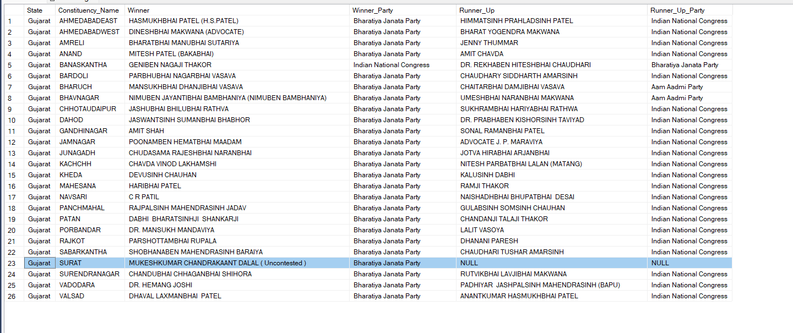

<sup/>[↑ Back to Top](#table-of-contents)

	- State-Wise Election Summary
 Query 15: Summarize the total seats, candidates, parties, and vote breakdown for any state.
 ```sql
SELECT 
	COUNT(DISTINCT(cd.Constituency_ID)) AS Total_Seats
	, COUNT(DISTINCT(cd.Candidate)) AS Total_Candidate
	, COUNT(DISTINCT(pr.Party)) AS Total_Parties
	, FORMAT(SUM(cd.EVM_Votes+cd.Postal_Votes), 'N0', 'en-IN') AS Total_Votes
	, FORMAT(SUM(cd.EVM_Votes), 'N0', 'en-IN') AS Total_EVM_Votes
	, FORMAT(SUM(cd.Postal_Votes), 'N0', 'en-IN') AS Total_Postal_Votes
	FROM constituencywise_details cd
JOIN constituencywise_results cr ON cd.Constituency_ID = cr.Constituency_ID
JOIN partywise_results pr ON cr.Party_ID = pr.Party_ID
JOIN statewise_results sr ON cr.Parliament_Constituency = sr.Parliament_Constituency
JOIN states s ON sr.State_ID = s.State_ID
WHERE s.State = 'Maharashtra';
```
Data preview:


<sup/>[↑ Back to Top](#table-of-contents)

---

## 5. Appendix: SQL Table Structure

To preview the structure of the dataset used in this project, the following SQL queries can be executed to explore the columns and data in each table.

```sql
-- View all columns in constituencywise_details
SELECT * FROM constituencywise_details;

-- View all columns in constituencywise_results
SELECT * FROM constituencywise_results;

-- View all columns in statewise_results
SELECT * FROM statewise_results;

-- View all columns in partywise_results
SELECT * FROM partywise_results;

-- View all columns in states
SELECT * FROM states;
```

---

## 6. Conclusion

This project demonstrates the practical application of SQL in solving business-related questions using real-world election data. SQL's flexibility in data handling and querying is shown through the insights derived from the Indian General Election 2024. Whether dealing with seat counts, alliances, or overall election results, SQL provides a straightforward yet powerful tool for uncovering key election insights.

↑ Back to Top
