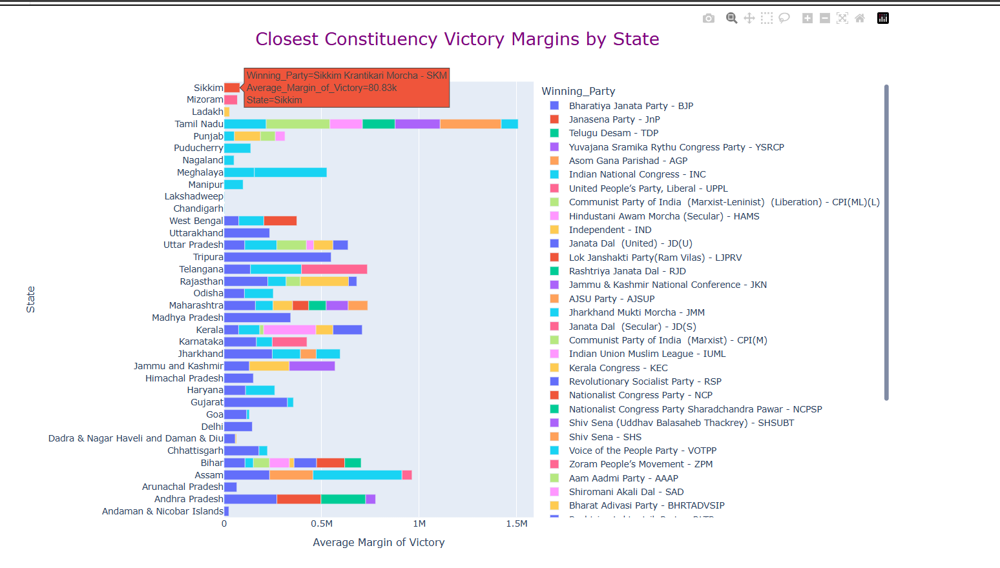

<a name="ige-2024"></a>
# &#9757; &#128286; Indian General Election 2024 - SQL + Python &#128013; Analysis &#9996;

## &#129521; Introduction
This project expands beyond SQL queries into Python-based data analysis and visualization to provide deeper insights into the Indian General Election 2024. By leveraging Python libraries such as Pandas, Matplotlib, and Plotly, we analyze closely contested seats, voting trends, and party performances across states. The integration of SQL and Python offers a comprehensive approach to solving real-world election-related business problems.

<a name="TOC"></a>
## &#128218; Table of Contents
1. [Overview](#overview)
2. [Business Problems Solved with SQL](#business-problems-solved-with-sql)
3. [Business Problems Solved with Python](#business-problems-solved-with-python)
4. [Project Structure](#project-structure)
5. [Database Schema](#database-schema)
6. [Key Python Analyses](#key-python-analyses)
7. [Appendix](#appendix)
8. [Conclusion](#conclusion)
9. [Challenges and Limitations](#challenges-and-limitations)
10. [License](#license)
11. [Disclaimer](#disclaimer)

---

<a name="1-overview"></a>
## &#127987; 1. Overview
This project aims to showcase the power of SQL by solving real-world business problems using the results of the Indian General Election 2024 dataset. The insights are derived from the election data, showing seat distribution across states, party alliances, and the results of various parties.

The data is stored in multiple tables, and the solution uses SQL queries to perform operations like aggregations, joins, and case-based updates to explore the election results.

<sup/>[↑ Back to Top](#TOC)

---

<a name="2-business-problems-solved-with-sql"></a>
## &#128166; 2. Business Problems Solved with SQL

	- Total Seats in Indian Parliament
&#11093; Query 1: Get the total number of seats in the Indian Parliament for 2024.
```sql
SELECT COUNT (DISTINCT Constituency_ID) AS 'India Parliament Constituency Seats'
	FROM constituencywise_results;
```
Data preview:


<sup/>[↑ Back to Top](#TOC)

	- Total Seats by State
&#11093; Query 2: Find the total number of seats available in each state for the 2024 elections.
```sql
SELECT State_Name, COUNT(DISTINCT Constituency_ID) AS 'Total Seats'
FROM constituencywise_results
GROUP BY State_Name;
```
Data preview:


<sup/>[↑ Back to Top](#TOC)

	- Total Seats Won by NDA
&#11093; Query 3: Calculate the total seats won by the NDA alliance in the 2024 elections.
```sql
WITH NDA_parties AS (
    SELECT Party_ID, Won
	FROM partywise_results
    WHERE Party IN ('Bharatiya Janata Party - BJP'
		, 'Telugu Desam - TDP'
		, 'Janata Dal  (United) - JD(U)'
		, 'Shiv Sena - SHS'
		, 'AJSU Party - AJSUP'
		, 'Apna Dal (Soneylal) - ADAL'
		, 'Asom Gana Parishad - AGP'
		, 'Hindustani Awam Morcha (Secular) - HAMS'
		, 'Janasena Party - JnP'
		, 'Janata Dal  (Secular) - JD(S)'
		, 'Lok Janshakti Party(Ram Vilas) - LJPRV'
		, 'Nationalist Congress Party - NCP'
		, 'Rashtriya Lok Dal - RLD'
		, 'Sikkim Krantikari Morcha - SKM')
)
, Constituency_agg AS (
    SELECT Party_ID, COUNT(DISTINCT (Constituency_ID)) AS Total_Seats
    FROM constituencywise_results
    GROUP BY Party_ID)
SELECT
    COUNT(NP.Party_ID) AS NDA_Allianz_Total_Parties
    , SUM(NP.Won) AS NDA_Allianz_Total_Seats_Won
    , (SELECT COUNT(DISTINCT (Constituency_ID)) FROM constituencywise_results) AS Total_Seats
FROM NDA_parties NP
JOIN Constituency_agg CA ON NP.Party_ID = CA.Party_ID;
```
Data preview:


<sup/>[↑ Back to Top](#TOC)

	- NDA Seats by Party
&#11093; Query 4: List the seats won by each party in the NDA alliance.
```sql
SELECT 
    party as NDA_Alliance_Party_Name,
    won as Seats_Won
FROM partywise_results
    WHERE Party IN ('Bharatiya Janata Party - BJP'
		, 'Telugu Desam - TDP'
		, 'Janata Dal  (United) - JD(U)'
		, 'Shiv Sena - SHS'
		, 'AJSU Party - AJSUP'
		, 'Apna Dal (Soneylal) - ADAL'
		, 'Asom Gana Parishad - AGP'
		, 'Hindustani Awam Morcha (Secular) - HAMS'
		, 'Janasena Party - JnP'
		, 'Janata Dal  (Secular) - JD(S)'
		, 'Lok Janshakti Party(Ram Vilas) - LJPRV'
		, 'Nationalist Congress Party - NCP'
		, 'Rashtriya Lok Dal - RLD'
		, 'Sikkim Krantikari Morcha - SKM')
ORDER BY 2 DESC;
```
Data preview:


<sup/>[↑ Back to Top](#TOC)

	- Total Seats Won by INDIA Alliance
&#11093; Query 5: Calculate the total seats won by the INDIA alliance in the 2024 elections.
```sql
WITH INDIA_parties AS (
    SELECT Party_ID, Won
	FROM partywise_results
    WHERE Party IN ('Indian National Congress - INC'
		, 'Aam Aadmi Party - AAAP'
		, 'All India Trinamool Congress - AITC'
		, 'Bharat Adivasi Party - BHRTADVSIP'
		, 'Communist Party of India  (Marxist) - CPI(M)'
		, 'Communist Party of India  (Marxist-Leninist)  (Liberation) - CPI(ML)(L)'
		, 'Communist Party of India - CPI'
		, 'Dravida Munnetra Kazhagam - DMK'
		, 'Indian Union Muslim League - IUML'
		, 'Nat`Jammu & Kashmir National Conference - JKN'
		, 'Jharkhand Mukti Morcha - JMM'
		, 'Jammu & Kashmir National Conference - JKN'
		, 'Kerala Congress - KEC'
		, 'Marumalarchi Dravida Munnetra Kazhagam - MDMK'
		, 'Nationalist Congress Party Sharadchandra Pawar - NCPSP'
		, 'Rashtriya Janata Dal - RJD'
		, 'Rashtriya Loktantrik Party - RLTP'
		, 'Revolutionary Socialist Party - RSP'
		, 'Samajwadi Party - SP'
		, 'Shiv Sena (Uddhav Balasaheb Thackrey) - SHSUBT'
		, 'Viduthalai Chiruthaigal Katchi - VCK')
)
, Constituency_agg AS (
    SELECT Party_ID, COUNT(DISTINCT (Constituency_ID)) AS Total_Seats
    FROM constituencywise_results
    GROUP BY Party_ID)
SELECT
    COUNT(IP.Party_ID) AS INDIA_Allianz_Total_Parties
    , SUM(IP.Won) AS INDIA_Allianz_Total_Seats_Won
    , (SELECT COUNT(DISTINCT (Constituency_ID)) FROM constituencywise_results) AS Total_Seats
FROM INDIA_parties IP
JOIN Constituency_agg CA ON IP.Party_ID = CA.Party_ID;
```
Data preview:


<sup/>[↑ Back to Top](#TOC)

	- INDIA Seats by Party
&#11093; Query 6: List the seats won by each party in the INDIA alliance.
```sql
SELECT 
    party as INDIA_Alliance_Party_Name,
    won as Seats_Won
FROM 
    partywise_results
    WHERE Party IN ('Indian National Congress - INC'
		, 'Aam Aadmi Party - AAAP'
		, 'All India Trinamool Congress - AITC'
		, 'Bharat Adivasi Party - BHRTADVSIP'
		, 'Communist Party of India  (Marxist) - CPI(M)'
		, 'Communist Party of India  (Marxist-Leninist)  (Liberation) - CPI(ML)(L)'
		, 'Communist Party of India - CPI'
		, 'Dravida Munnetra Kazhagam - DMK'
		, 'Indian Union Muslim League - IUML'
		, 'Nat`Jammu & Kashmir National Conference - JKN'
		, 'Jharkhand Mukti Morcha - JMM'
		, 'Jammu & Kashmir National Conference - JKN'
		, 'Kerala Congress - KEC'
		, 'Marumalarchi Dravida Munnetra Kazhagam - MDMK'
		, 'Nationalist Congress Party Sharadchandra Pawar - NCPSP'
		, 'Rashtriya Janata Dal - RJD'
		, 'Rashtriya Loktantrik Party - RLTP'
		, 'Revolutionary Socialist Party - RSP'
		, 'Samajwadi Party - SP'
		, 'Shiv Sena (Uddhav Balasaheb Thackrey) - SHSUBT'
		, 'Viduthalai Chiruthaigal Katchi - VCK')
ORDER BY 2 DESC;
```
Data preview:


<sup/>[↑ Back to Top](#TOC)

	- Add Party Alliance Column
&#11093; Query 7: Add a column to categorize parties into NDA, INDIA, or OTHER alliances.
```sql
ALTER TABLE partywise_results
ADD party_alliance VARCHAR(50);

UPDATE partywise_results
SET party_alliance = 
    CASE 
        WHEN party IN ('Bharatiya Janata Party - BJP'
            , 'Telugu Desam - TDP'
            , 'Janata Dal  (United) - JD(U)'
            , 'Shiv Sena - SHS'
            , 'AJSU Party - AJSUP'
            , 'Apna Dal (Soneylal) - ADAL'
            , 'Asom Gana Parishad - AGP'
            , 'Hindustani Awam Morcha (Secular) - HAMS'
            , 'Janasena Party - JnP'
            , 'Janata Dal  (Secular) - JD(S)'
            , 'Lok Janshakti Party(Ram Vilas) - LJPRV'
            , 'Nationalist Congress Party - NCP'
            , 'Rashtriya Lok Dal - RLD'
            , 'Sikkim Krantikari Morcha - SKM'
        ) THEN 'NDA'
        WHEN party IN ('Indian National Congress - INC'
            , 'Aam Aadmi Party - AAAP'
            , 'All India Trinamool Congress - AITC'
            , 'Bharat Adivasi Party - BHRTADVSIP'
            , 'Communist Party of India  (Marxist) - CPI(M)'
            , 'Communist Party of India  (Marxist-Leninist) (Liberation) - CPI(ML)(L)'
            , 'Communist Party of India - CPI'
            , 'Dravida Munnetra Kazhagam - DMK'
            , 'Indian Union Muslim League - IUML'
            , 'Jammu & Kashmir National Conference - JKN'
            , 'Jharkhand Mukti Morcha - JMM'
            , 'Kerala Congress - KEC'
            , 'Marumalarchi Dravida Munnetra Kazhagam - MDMK'
            , 'Nationalist Congress Party Sharadchandra Pawar - NCPSP'
            , 'Rashtriya Janata Dal - RJD'
            , 'Rashtriya Loktantrik Party - RLTP'
            , 'Revolutionary Socialist Party - RSP'
            , 'Samajwadi Party - SP'
            , 'Shiv Sena (Uddhav Balasaheb Thackrey) - SHSUBT'
            , 'Viduthalai Chiruthaigal Katchi - VCK'
        ) THEN 'INDIA'
        ELSE 'OTHER'
    END;
```
Data preview:


<sup/>[↑ Back to Top](#TOC)

	- Alliance with Most Seats
&#11093; Query 8: Identify the party alliance that won the most seats nationwide.
```sql
SELECT 
	pr.party_alliance, COUNT(cr.Parliament_Constituency) Seats_Won
	FROM partywise_results pr
JOIN constituencywise_results cr ON pr.Party_ID = cr.Party_ID
where pr.party_alliance IN ('NDA', 'INDIA', 'OTHER')
GROUP BY pr.party_alliance
ORDER BY 2 DESC;
```
Data preview:


<sup/>[↑ Back to Top](#TOC)

	- Winning Details for a Specific Constituency
&#11093; Query 9: Retrieve the winning candidate's name, party, alliance, total votes, and margin for a specific state and constituency.
```sql
SELECT
	s.State, cr.Constituency_Name
	FROM constituencywise_results cr
JOIN statewise_results sr ON cr.Parliament_Constituency = sr.Parliament_Constituency
JOIN states s ON sr.State_ID = s.State_ID
WHERE s.State = 'Uttar Pradesh';

SELECT
	cr.Winning_Candidate, pr.Party, pr.party_alliance
	, FORMAT(cr.Total_Votes, 'N0', 'en-IN') AS Total_Votes
	, FORMAT(cr.Margin, 'N0', 'en-IN') AS Margin
	, s.State, cr.Constituency_Name
	FROM partywise_results pr
JOIN constituencywise_results cr ON pr.Party_ID = cr.Party_ID
JOIN statewise_results sr ON cr.Parliament_Constituency = sr.Parliament_Constituency
JOIN states s ON sr.State_ID = s.State_ID
WHERE s.State = 'Uttar Pradesh' AND cr.Constituency_Name = 'ETAH';
```
Data preview:


<sup/>[↑ Back to Top](#TOC)

	- EVM vs Postal Vote Distribution
&#11093; Query 10: Analyze the distribution of EVM votes versus postal votes in a specific constituency.
```sql
SELECT
	DISTINCT Constituency_Name
	FROM constituencywise_results
WHERE Constituency_Name LIKE 'D%';

SELECT
	cd.Candidate, cd.Party
	, FORMAT(cd.EVM_Votes, 'N0', 'en-IN') AS EVM_Votes
	, FORMAT(cd.Postal_Votes, 'N0', 'en-IN') AS Postal_Votes
	, FORMAT(cd.Total_Votes, 'N0', 'en-IN') AS Total_Votes
	, cr.Constituency_Name
	FROM constituencywise_details cd
JOIN constituencywise_results cr ON cd.Constituency_ID = cr.Constituency_ID
WHERE cr.Constituency_Name='DURG'
ORDER BY 5 DESC;
```
Data preview:


<sup/>[↑ Back to Top](#TOC)

	- Most Seats Won in a State
&#11093; Query 11: Find the parties that won the most seats in a state, along with seat counts.
```sql
SELECT
	pr.Party, COUNT(cr.Constituency_ID) AS Seats_Won
	FROM partywise_results pr
JOIN constituencywise_results cr ON pr.Party_ID = cr.Party_ID
JOIN statewise_results sr ON cr.Parliament_Constituency = sr.Parliament_Constituency
JOIN states s ON sr.State_ID = s.State_ID
WHERE s.State = 'Andhra Pradesh'
GROUP BY pr.Party
ORDER BY 2 DESC;
```
Data preview:


<sup/>[↑ Back to Top](#TOC)

	- Alliance-wise Wins by State
&#11093; Query 12: Calculate the total seats won by each alliance in each state.
```sql
SELECT
	st.State
	, SUM(CASE WHEN pr.party_alliance='NDA' THEN 1 ELSE NULL END) AS NDA_Seats_Won
	, SUM(CASE WHEN pr.party_alliance='INDIA' THEN 1 ELSE NULL END) AS INDIA_Seats_Won
	, SUM(CASE WHEN pr.party_alliance='OTHER' THEN 1 ELSE NULL END) AS OTHER_Seats_Won
	FROM states st
JOIN statewise_results sr ON st.State_ID = sr.State_ID
JOIN constituencywise_results cr ON sr.Parliament_Constituency = cr.Parliament_Constituency
JOIN partywise_results pr ON cr.Party_ID = pr.Party_ID
-- WHERE pr.party_alliance IN ('NDA', 'INDIA', 'OTHER')
WHERE st.State IN ('Assam', 'Bihar')
GROUP BY st.State
ORDER BY st.State;

-- OR --

WITH Party_Alliance_Winnings AS (
    SELECT st.State
        , SUM(CASE WHEN pr.Party_Alliance = 'NDA' THEN 1 ELSE 0 END) AS NDA_Won_Seats
        , SUM(CASE WHEN pr.Party_Alliance = 'INDIA' THEN 1 ELSE 0 END) AS INDIA_Won_Seats
        , SUM(CASE WHEN pr.Party_Alliance = 'OTHER' THEN 1 ELSE 0 END) AS Other_Won_Seats
    FROM states st
    JOIN statewise_results sr ON st.State_ID = sr.State_ID
    JOIN constituencywise_results cr ON sr.Parliament_Constituency = cr.Parliament_Constituency
    JOIN partywise_results pr ON cr.Party_ID = pr.Party_ID
    WHERE st.State IN ('Assam', 'Bihar')
    GROUP BY st.State
)
SELECT PAW.*
    , (SELECT COUNT(DISTINCT sr.Parliament_Constituency)
       FROM statewise_results sr
       WHERE sr.State_ID = (
		SELECT st2.State_ID FROM states st2 WHERE st2.State = PAW.State)
      ) AS Total_Constituencies
FROM Party_Alliance_Winnings PAW;
```
Data preview:


<sup/>[↑ Back to Top](#TOC)

	- Top EVM Votes by Constituency
&#11093; Query 13: Identify the top candidates by EVM votes for each constituency.
```sql
SELECT TOP 10
	cd.Constituency_ID, cr.Constituency_Name, cd.Candidate
	, FORMAT(cd.EVM_Votes, 'N0', 'en-IN') AS EVM_Votes
	FROM constituencywise_details cd
JOIN constituencywise_results cr ON cd.Constituency_ID = cr.Constituency_ID
WHERE cd.EVM_Votes = (
	SELECT MAX(cd1.EVM_Votes)
	FROM constituencywise_details cd1
	WHERE cd1.Constituency_ID = cd.Constituency_ID)
ORDER BY 4 DESC;
```
Data preview:


<sup/>[↑ Back to Top](#TOC)

	- Winner and Runner-up by Constituency
&#11093; Query 14: Find the winner and runner-up for each constituency in a given state.
```sql
WITH RankedCandidates AS (
    SELECT 
        cd.Constituency_ID
        , cd.Candidate
		, ROW_NUMBER() OVER (PARTITION BY cd.Constituency_ID ORDER BY cd.Total_Votes DESC) AS VoteRank
    FROM constituencywise_details cd
    JOIN constituencywise_results cr ON cd.Constituency_ID = cr.Constituency_ID
    JOIN statewise_results sr ON cr.Parliament_Constituency = sr.Parliament_Constituency
    JOIN states st ON sr.State_ID = st.State_ID
    WHERE st.State = 'Gujarat'
)
SELECT 
    cr.Constituency_Name
    , MAX(CASE WHEN rc.VoteRank = 1 THEN rc.Candidate END) AS Winning_Candidate
    , MAX(CASE WHEN rc.VoteRank = 2 THEN rc.Candidate END) AS Runnerup_Candidate
FROM RankedCandidates rc
JOIN constituencywise_results cr ON rc.Constituency_ID = cr.Constituency_ID
GROUP BY cr.Constituency_Name
ORDER BY cr.Constituency_Name;

-- OR --

WITH ElectionResultsRank AS (
    SELECT
        st.State,
        cr.Constituency_Name,
        cd.Candidate,
        cd.Party,
        ROW_NUMBER() OVER (PARTITION BY cd.Constituency_ID ORDER BY cd.Total_Votes DESC) AS Rank_Position
    FROM states st
    JOIN statewise_results sr ON st.State_ID = sr.State_ID
    JOIN constituencywise_results cr ON sr.Parliament_Constituency = cr.Parliament_Constituency
    JOIN constituencywise_details cd ON cr.Constituency_ID = cd.Constituency_ID
)
SELECT
    ER.State,
    ER.Constituency_Name,
    MAX(CASE WHEN ER.Rank_Position = 1 THEN ER.Candidate END) AS Winner,
    MAX(CASE WHEN ER.Rank_Position = 1 THEN ER.Party END) AS Winner_Party,
    MAX(CASE WHEN ER.Rank_Position = 2 THEN ER.Candidate END) AS Runner_Up,
    MAX(CASE WHEN ER.Rank_Position = 2 THEN ER.Party END) AS Runner_Up_Party
FROM ElectionResultsRank ER
-- WHERE ER.State = 'Gujarat'
WHERE ER.State = 'Gujarat'  -- condition to filter by state if needed, so!!
GROUP BY ER.State, ER.Constituency_Name
ORDER BY 1, 2;
```
Data preview:


<sup/>[↑ Back to Top](#TOC)

	- State-Wise Election Summary
&#11093; Query 15: Summarize the total seats, candidates, parties, and vote breakdown for any state.
```sql
SELECT 
	COUNT(DISTINCT(cd.Constituency_ID)) AS Total_Seats
	, COUNT(DISTINCT(cd.Candidate)) AS Total_Candidate
	, COUNT(DISTINCT(pr.Party)) AS Total_Parties
	, FORMAT(SUM(cd.EVM_Votes+cd.Postal_Votes), 'N0', 'en-IN') AS Total_Votes
	, FORMAT(SUM(cd.EVM_Votes), 'N0', 'en-IN') AS Total_EVM_Votes
	, FORMAT(SUM(cd.Postal_Votes), 'N0', 'en-IN') AS Total_Postal_Votes
	FROM constituencywise_details cd
JOIN constituencywise_results cr ON cd.Constituency_ID = cr.Constituency_ID
JOIN partywise_results pr ON cr.Party_ID = pr.Party_ID
JOIN statewise_results sr ON cr.Parliament_Constituency = sr.Parliament_Constituency
JOIN states s ON sr.State_ID = s.State_ID
WHERE s.State = 'Maharashtra';
```
Data preview:


<sup/>[↑ Back to Top](#TOC)

---

<a name="3-business-problems-solved-with-python"></a>
## 3. Business Problems Solved with Python &#128013;

	Query 1. Comparing Results Over Multiple Constituencies
&#128205; Business Problem: Identify constituencies where political parties won by the largest margin, providing a clearer picture of their strongholds.

```python
# Importing necessary libraries
import pandas as pd
import sqlite3

# query to fetch largest margin of winning
query_largest_margin_winning = """
SELECT st.State
      , cr.[constituency name] AS 'Constituency Name'
      , pr.Party AS 'Party Name'
      , MAX(sr.margin) AS 'Largest Margin'
      FROM states st
JOIN statewise_results sr ON st.[State ID] = sr.[State ID]
JOIN constituencywise_results cr ON sr.[Parliament Constituency] = cr.[Parliament Constituency]
JOIN partywise_results pr ON cr.[Party ID] = pr.[Party ID]
GROUP BY st.State, cr.[constituency name], pr.Party
ORDER BY 4 DESC;
"""

# Run the query and load the results into a DataFrame
df_largest_margin_winning = pd.read_sql(query_largest_margin_winning, conn)

# print the DataFrame
print(df_largest_margin_winning.head(10))
```
Data preview:


- &#128278; Summary of Query Result:

```The SQL query highlights constituencies where the winning margin was significant. These constituencies represent strongholds for political parties and may be key to future electoral strategies.```

<sup/>[↑ Back to Top](#TOC)

	- Visualization using Plotly (Interactive Bar Chart)
 ```python
# Importing necessary libraries
import plotly.express as px

# Optionally limit to top 10 constituencies with the largest margin
df_largest_margin_winning_top = df_largest_margin_winning.nlargest(10, 'Largest Margin')

# Create a plotly bar chart (grouped for better clarity)
fig = px.bar(df_largest_margin_winning_top
             , x='Constituency Name'
             , y='Largest Margin'
             , color='Party Name'
             , title='Top 10 Constituencies with the Largest Winning Margin'
             , hover_data=['State', 'Party Name'])

# Customize the layout for better readability
fig.update_layout(barmode='group'  # Use group mode instead of stack for clarity
                  , xaxis={'categoryorder':'total descending'}  # Order bars by margin
                  , height=600
                  , width=1200
                  , xaxis_title='Constituency'
                  , yaxis_title='Largest Winning Margin')

# Add hover mode for enhanced interactivity
fig.update_traces(hovertemplate="<b>%{x}</b><br>Margin: %{y}<br>Party: %{customdata[1]}<br>State: %{customdata[0]}")

# Show the interactive plot
fig.show()
```
Data preview:


- &#128304; Revised Summary for the Plot:

```Constituencies with large margins of victory are typically safe seats for political parties. The BJP maintained several strongholds in northern India, while the INC secured significant wins in Kerala and Punjab. These safe seats provide a foundation for future election campaigns.```

<sup/>[↑ Back to Top](#TOC)

	Query 2: Analysis of Closely Contested Seats
&#128205; Business Problem: Identify the most closely contested constituencies in the 2024 General Election, focusing on constituencies where the margin of victory was smallest. Analyze factors like party affiliation and regional distribution to understand how these close contests might influence future election strategies.

```python
# Importing necessary libraries
import pandas as pd

# query to fetch the constituencies where the margin of victory was smallest.
query_closely_contested_seats = """
SELECT cr.[Parliament Constituency] AS 'Constituency Name'
    , pr.Party AS Party
    , st.State AS State
    , sr.Margin AS 'Margin of Victory'  -- No format function here
FROM constituencywise_results cr
JOIN partywise_results pr ON cr.[Party ID] = pr.[Party ID]
JOIN statewise_results sr ON cr.[Parliament Constituency] = sr.[Parliament Constituency]
JOIN states st ON sr.[State ID] = st.[State ID]
WHERE st.State = 'Punjab'
GROUP BY cr.[Parliament Constituency], pr.Party, st.State, sr.Margin
ORDER BY sr.Margin;
"""

# Assuming already loaded the data into df_contested_seats
df_contested_seats = pd.read_sql(query_closely_contested_seats, conn)

# Convert the 'Margin of Victory' column to numeric
df_contested_seats['Margin of Victory'] = pd.to_numeric(df_contested_seats['Margin of Victory'])

# Now select only the top 10 rows
df_contested_seats_top_10 = df_contested_seats.head(10)

# Verify the data
print(df_contested_seats_top_10)
```
Data preview:


- &#128278; Summary of Query Result:

```The top 10 closely contested constituencies show that regions in states like Maharashtra and Gujarat are crucial battlegrounds with narrow victory margins. Bharatiya Janata Party (BJP) had strong showings in these areas, indicating the need for intensified campaigning from opposition parties.```

<sup/>[↑ Back to Top](#TOC)

	Visualization using Plotly bar plot
 ```python
# Importing necessary libraries
import plotly.express as px

# Create a Plotly bar plot
fig = px.bar(df_contested_seats_top_10, 
             x='Margin of Victory', 
             y='Constituency Name', 
             color='Party', 
             orientation='h', 
             color_continuous_scale='cividis',  # You can still use 'cividis' here
             labels={
                 'Margin of Victory': 'Margin of Victory',
                 'Constituency Name': 'Constituency Name'
             },
             title='Top 10 Closely Contested Seats in Punjab')

# Update layout for a larger and more visually appealing title
fig.update_layout(
    title={
        'text': 'Top 10 Closely Contested Seats in Punjab'
        , 'x': 0.5  # Center title horizontally
        , 'xanchor': 'center'
        , 'yanchor': 'top'
        , 'font': {
            'size': 24  # Increase the font size
            , 'color': 'purple'  # Change title color if needed
        }
    },
    xaxis_title='Margin of Victory',
    yaxis_title='Constituency Name',
    height=500
)

# Show the plot with the updated title
fig.show()
```
Data preview:


- &#128304; Revised Summary for the Plot:

```The 2024 Indian General Election revealed several closely contested states, where the margins of victory were narrow. The data shows that the Bharatiya Janata Party (BJP) dominated in regions such as the East Coast and West Coast, indicating divided voter sentiments. For future election campaigns, political parties must focus on these battleground states. Below are the top 10 states with the smallest margins of victory.```

<sup/>[↑ Back to Top](#TOC)

	Query 3: Analysis of Party Performance in Close Contests
&#128205; Business Problem: Analyze which political parties consistently win tight races across states and constituencies, indicating their ability to sway voters in contested areas. This helps parties understand where they are vulnerable and how to strategize for future elections.

```python
# Importing necessary libraries
import pandas as pd

# query to fetch the average margin of victory for each state.
query_average_margin_of_victory = """
WITH ConstituencyMargins AS (
    SELECT 
        st.State,
        cr.[Constituency Name] AS 'Constituency Name',
        pr.Party AS 'Winning_Party',
        sr.Margin AS 'Margin_of_Victory'
    FROM constituencywise_results cr
    JOIN partywise_results pr ON cr.[Party ID] = pr.[Party ID]
    JOIN statewise_results sr ON cr.[Parliament Constituency] = sr.[Parliament Constituency]
    JOIN states st ON sr.[State ID] = st.[State ID]
)
, StatePartyMargins AS (
    SELECT 
        State,
        Winning_Party,
        AVG(Margin_of_Victory) AS 'Average_Margin_of_Victory'
    FROM ConstituencyMargins
    GROUP BY State, Winning_Party
)
SELECT * 
FROM StatePartyMargins;
"""

# Run the query and load the results into a DataFrame
df_average_margin_of_victory = pd.read_sql(query_average_margin_of_victory, conn)

# Round the 'vote_share_percentage' column to two decimal places
df_average_margin_of_victory['Average_Margin_of_Victory'] = df_average_margin_of_victory['Average_Margin_of_Victory'].round(2)

# Display the first 10 rows of the DataFrame for verification
print(df_average_margin_of_victory.head(10))
```
Data preview:


- &#128278; Summary of Query Result:

```BJP dominated many of the closely contested constituencies, especially in Gujarat and Rajasthan. INC, while trailing in these regions, still managed to perform well in states like Kerala and Punjab, where the margins were small but significant. This analysis reveals key battlegrounds for both parties.```

<sup/>[↑ Back to Top](#TOC)

	Visualization using Plotly (Interactive Bar Chart)
 ```python
# Importing necessary libraries
import plotly.express as px

# Assuming you have a DataFrame with the closest margin of victory for each state
fig = px.bar(
    df_average_margin_of_victory, 
    x='Average_Margin_of_Victory', 
    y='State', 
    color='Winning_Party', 
    orientation='h', 
    title='Closest Constituency Victory Margins by State'
)

# Adjusting the layout to increase figure size and readability
fig.update_layout(
    title={
        'text': 'Closest Constituency Victory Margins by State',
        'x': 0.5,
        'xanchor': 'center',
        'font': {
            'size': 24,
            'color': 'purple'
        }
    },
    xaxis_title='Average Margin of Victory',
    yaxis_title='State',
    width=1200,  # Increase the width of the plot
    height=800,  # Increase the height of the plot
    margin=dict(l=150, r=50, t=100, b=100)  # Add margins for better spacing
)

# Show the plot
fig.show()
```
Data preview:



- &#128304; Revised Summary for the Plot:

```The BJP led in many close contests, particularly in states like Gujarat, Odisha, and Rajasthan. Its consistent performance in states with narrow margins signals strong voter loyalty, while the Indian National Congress (INC) closely followed in key states like Kerala and Punjab. These regions are critical battlegrounds for future elections, and political parties may need to reassess their strategies.```

<sup/>[↑ Back to Top](#TOC)

	Query 4: Analysis of Average Margin of Victory per State
&#128205; Business Problem: Analyze the average margin of victory across all Indian states, to find patterns that indicate regional competitiveness and voter behavior.

```python
# Importing necessary libraries
import pandas as pd
import sqlite3

# query to fetch average margin of victory across all Indian states
query_avg_margin_of_victory = """
SELECT st.State, AVG(sr.Margin) AS avg_margin_of_victory
FROM constituencywise_results cr
JOIN partywise_results pr ON cr.[Party ID] = pr.[Party ID]
JOIN statewise_results sr ON cr.[Parliament Constituency] = sr.[Parliament Constituency]
JOIN states st ON sr.[State ID] = st.[State ID]
GROUP BY st.State;
"""

# Run the query and load the results into a DataFrame
df_avg_margin_of_victory = pd.read_sql(query_avg_margin_of_victory, conn)

# Round the 'vote_share_percentage' column to two decimal places
df_avg_margin_of_victory['avg_margin_of_victory'] = df_avg_margin_of_victory['avg_margin_of_victory'].round(2)

# Display the first 10 rows of the DataFrame for verification
print(df_avg_margin_of_victory.head(10))
```
Data preview:


- &#128278; Summary of Query Result:

```This query analyzes the average margin of victory for each state, providing insights into states with highly competitive elections versus those with large winning margins.```

<sup/>[↑ Back to Top](#TOC)

	Visualization using Plotly (Interactive Bar Chart)
```python
# Importing necessary libraries
import pandas as pd
import plotly.express as px

# Data: Average margin of victory per state
data = {
    'State': ['Andaman & Nicobar Islands', 'Andhra Pradesh', 'Arunachal Pradesh', 'Assam', 'Bihar', 'Chandigarh',
              'Chhattisgarh', 'Dadra & Nagar Haveli and Daman & Diu', 'Delhi', 'Goa', 'Gujarat', 'Haryana',
              'Himachal Pradesh', 'Jammu and Kashmir', 'Jharkhand', 'Karnataka', 'Kerala', 'Ladakh', 'Lakshadweep',
              'Madhya Pradesh', 'Maharashtra', 'Manipur', 'Meghalaya', 'Mizoram', 'Nagaland', 'Odisha', 'Puducherry',
              'Punjab', 'Rajasthan', 'Sikkim', 'Tamil Nadu', 'Telangana', 'Tripura', 'Uttar Pradesh', 'Uttarakhand',
              'West Bengal'],
    'avg_margin_of_victory': [24396, 205199.32, 65579.50, 267453.07, 103835.18, 2504, 166687.36, 31904.50, 144904.43,
                              64775, 313793.04, 129912.90, 150114.50, 186844.60, 194003, 139474.25, 119169.40, 27862,
                              2647, 341365.45, 109118.46, 97609.50, 263575.50, 68288, 50984, 106489.95, 136516,
                              70516.77, 170156.28, 80830, 222254.77, 206619.76, 549198.50, 96791.01, 233739.40,
                              141548.14]
}

# Creating DataFrame
df = pd.DataFrame(data)

# Sorting data for better visualization
df_sorted = df.sort_values(by='avg_margin_of_victory', ascending=False)

# Creating an interactive bar chart with Plotly
fig = px.bar(df_sorted, 
             x='avg_margin_of_victory', 
             y='State', 
             orientation='h',  # Horizontal bar chart
             title='Average Margin of Victory per State (Indian General Election 2024)',
             labels={'avg_margin_of_victory': 'Average Margin of Victory', 'State': 'State'},  # Labeling axes
             hover_data=['avg_margin_of_victory'],  # Adding hover information
             text='avg_margin_of_victory'  # Display values on bars
             )

# Customizing the bar color using a close match to cividis ('darkslategray')
fig.update_traces(marker_color='darkslategray', texttemplate='%{text:.2s}', textposition='outside')

# Updating layout for better visual appeal
fig.update_layout(
    xaxis_title='Average Margin of Victory',
    yaxis_title='State',
    title=dict(text='Average Margin of Victory per State (Indian General Election 2024)',
               x=0.5,  # Centers the title
               font=dict(color='purple', size=20)),  # Title styling
    height=700,  # Adjusting height of the plot
    width=990,  # Adjusting width of the plot
    hoverlabel=dict(bgcolor="white", font_size=12),  # Hover label customization
    showlegend=False  # Disabling legend
)

# Displaying the interactive plot
fig.show()
```
Data preview:


- &#128304; Revised Summary for the Plot:

```States with small average margins of victory, such as Gujarat and Kerala, are highly competitive. Political parties must focus on these regions to improve their chances in future elections. In contrast, states with large margins, like Madhya Pradesh, represent safer territories for the winning party.```

<sup/>[↑ Back to Top](#TOC)

---

<a name="4-project-structure"></a>
## &#128223; 4. Project Structure

This project is structured around two key components:

    SQL Queries and Analysis: Initial analysis and insights were derived using SQL to answer election-related business problems.
    Python Analysis and Visualization: More advanced data analysis and visualization were performed using Python to explore trends in voter behavior, closely contested seats, and party performance.

#### &#128194; The Directory Structure:

```bash
Indian-General-Election-2024/
¦
+-- SQL/
¦   +-- database_creation.sql       		# SQL script for database setup
¦   +-- queries.sql                 		# SQL queries for solving business problems
¦   +-- outputs/                    		# Output data and figures from SQL analysis
¦   +-- README.md                   		# Documentation for SQL section
¦
+-- Python/
¦   +-- Indian_General_Election_2024.ipynb	# Jupyter notebook for Python analysis
¦   +-- plots/                       		# Visual outputs from Python analysis
¦   +-- requirements.txt              		# Lists the necessary Python packages for running the Notebook
¦   +-- README.md                    		# Documentation for Python section
¦
+-- PDF/                             
¦   +-- IGE_2024_Jupyter_Notebook.pdf    # A PDF version of the analysis Notebook for easy viewing
¦
+-- data/                            		# Datasets used in the analysis
+-- README.md                        		# Main README for the project
```

<sup/>[↑ Back to Top](#TOC)

---

<a name="5-database-schema"></a>
## &#128204; 5. Database Schema

The ERD:


<sup/>[↑ Back to Top](#TOC)

---

<a name="6-key-python-analyses"></a>
## 6. Key Python &#128013; Analyses

The following are the key Python analyses performed to explore election data beyond SQL queries:
6.1: Closely Contested Constituencies

    Objective: Identify constituencies with the narrowest victory margins and analyze the performance of different parties in these areas.
    Visualization: Bar charts and Choropleth maps (planned) to highlight constituencies and states with the smallest victory margins.

6.2: Party Performance by State

    Objective: Compare party performance across different states to identify trends in voter behavior.
    Visualization: Bar charts and pie charts to compare seat wins by party across multiple states.

<sup/>[↑ Back to Top](#TOC)

---

<a name="7-appendix"></a>
## &#127997; 7. Appendix: SQL Table Structure

To preview the structure of the dataset used in this project, the following SQL queries can be executed to explore the columns and data in each table.

```sql
-- View all columns in constituencywise_details
SELECT * FROM constituencywise_details;

-- View all columns in constituencywise_results
SELECT * FROM constituencywise_results;

-- View all columns in statewise_results
SELECT * FROM statewise_results;

-- View all columns in partywise_results
SELECT * FROM partywise_results;

-- View all columns in states
SELECT * FROM states;
```

<sup/>[↑ Back to Top](#TOC)

---

<a name="8-conclusion"></a>
## &#9193; 8. Conclusion &#9194;

	This project successfully identified key insights into closely contested seats in the Indian General Election, with a special focus on Punjab. By analyzing the margin of victory and the performance of major political parties, we have gained a clearer picture of the battleground constituencies. SQL's flexibility in data handling and querying is shown through the insights derived from the Indian General Election 2024. Whether dealing with seat counts, alliances, or overall election results, SQL provides a straightforward yet powerful tool for uncovering key election insights.These findings could be valuable for future election strategies and campaign planning.

    The project also reflects adaptability, as challenges like technical limitations were faced and worked around to still deliver meaningful results. Future iterations of this project could expand with geospatial analysis and other advanced features.

<sup/>[↑ Back to Top](#TOC)

---

<a name="9-challenges-and-limitations"></a>
## &#9940; 9. Challenges and Limitations &#9940;

	Technical Constraints: Due to limited system resources and technical difficulties in setting up Geopandas, the geospatial mapping for visualizing constituency data was not completed. Future updates to the project will focus on resolving these issues and providing more in-depth geographical analyses.
    Data Limitations: The dataset primarily focuses on election results without deep voter demographic data, which could have further enriched the analysis.

<sup/>[↑ Back to Top](#TOC)

---

<a name="10-license"></a>
## &#129516; 10. License

This project is licensed under the MIT License - see the LICENSE file for details.


<sup/>[↑ Back to Top](#TOC)

---

<a name="11-disclaimer"></a>
## &#128268; 11. Disclaimer

#### Disclaimer
```markdown
This analysis is conducted for educational and informational purposes only. While every effort has been made to ensure the accuracy of the data and analysis, no guarantees can be made regarding their completeness or reliability. The results and interpretations in this project are based on publicly available data and may not fully reflect the actual Election outcomes or dynamics.
```

<sup/>[↑ Back to Top](#ige-2024)

---
---
